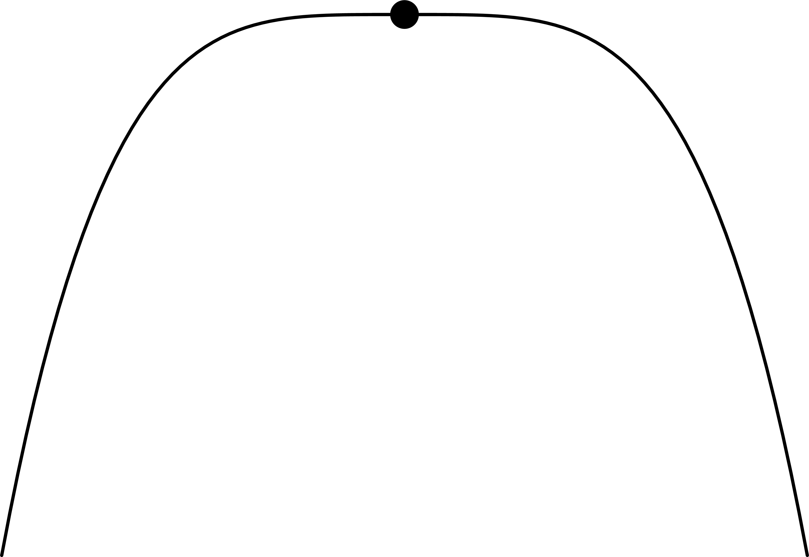
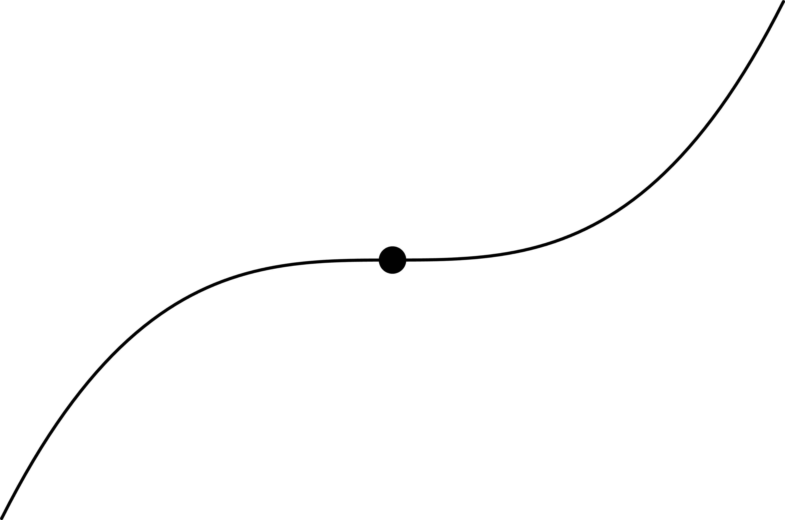
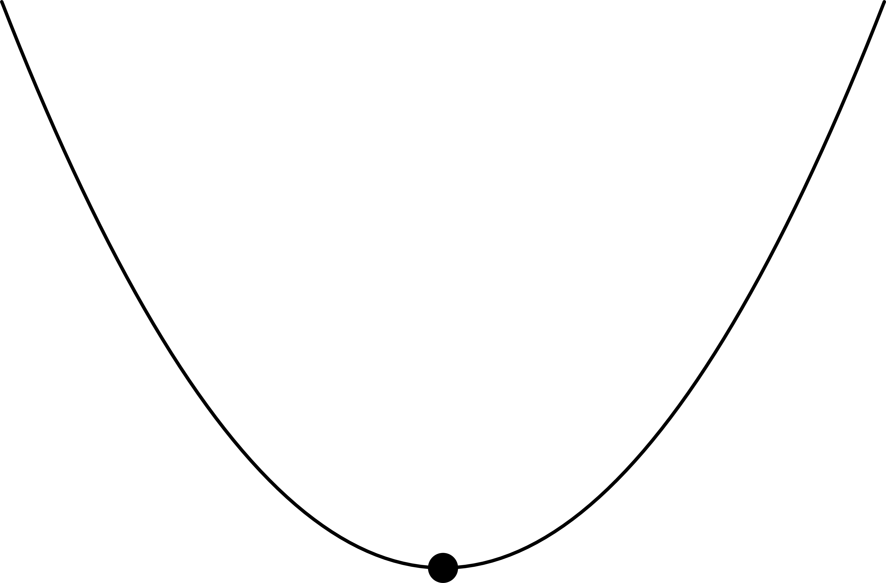

---
kernelspec:
  name: python3
  display_name: 'Python 3'
---

# Optimality conditions for unconstrained optimization

First, we consider the unconstrained optimization problem

```{math}
:label:optim-problem-unconstrained
\begin{array}{ll}
\minimize& f_0({x})\\
\st & x \in \mathbb{R}^n
\end{array}
```

We assume that $f_0$ has "good" properties on $\mathbb{R}^n$, i.e., $f_0$ is twice continuously differentiable (or at least continuously differentiable).

Provided optima exist (not always guaranteed!), we will derive conditions on a point $x^\star$ to be a **local optimum** of the problem. (in the unconstrained case, one also says that $x^\star$ is a **local minimizer** of $f_0$).
To be able to characterize **global optimality**, we'll need to assume convexity of the objective function $f_0$.

:::{important}
Optimality conditions for the unconstrained optimization problem [](#optim-problem-unconstrained) can be of different types:

- **Necessary**, **sufficient** or **necessary and sufficient**
- **First-order** (i.e. involving $\nabla f_0$) or **second-order** (i.e. involving $\nabla^2 f_0$)
:::

Most of the results from this section are reproduced from @nocedal2006numerical [Chapter 2], where detailed proofs are available.

### Necessary conditions (unconstrained case)

:::{prf:theorem} First-order necessary conditions [@nocedal2006numerical, Theorem 2.2]
:label:thm:necessary-unconstrained-first
If $x^\star$ is a local optimum and $f_0$ is continuously differentiable in an open neighborhood of $x^\star$, then $\nabla f_0 (x^\star) = 0$.
:::

We call $x^\star$ a **stationary** or **critical** point of $f_0$ if $\nabla f_0(x^\star) = 0$.

Any local optima must be a stationary point.

:::{prf:theorem} Second-order necessary conditions [@nocedal2006numerical, Theorem 2.3]
:label:thm:necessary-unconstrained-second
If $x^\star$ is a local optimum and $f_0$ is twice continuously differentiable in an open neighborhood of $x^\star$, then $\nabla f_0(x^\star) = 0$ and $\nabla^2 f_0(x^\star) \succeq 0$ (is positive semidefinite).
:::

:::{exercise}
:class:dropdown
Prove [](#thm:necessary-unconstrained-first) and [](#thm:necessary-unconstrained-second) by contradiction using Taylor's theorem.
:::

:::::{warning} Having $\nabla f_0(x^\star) = 0$ is not (always) enough ...
[](#thm:necessary-unconstrained-first) and [](#thm:necessary-unconstrained-second) only give **necessary** conditions for a point $x^\star$ to be optimal.
Some possible situations in 1D.
::::{grid}

:::{card}
:header: $f_0''(x^\star) = 0$ (maximum)


:::

:::{card}
:header: $f''_0(x^\star) = 0$ (saddle point)

:::

:::{card}
:header: $f''_0(x^\star) > 0$ (strict local optimum)


:::
::::
For higher dimensions (here 2D), the situation is even more subtle.
::::{grid}

:::{card}
:header: $\nabla^2 f_0 (x^\star) \succ 0$ (strict local optimum)


:::

:::{card}
:header: $\nabla^2 f_0 (x^\star) \succeq 0$ (saddle point)

:::

:::{card}
:header: $\nabla^2 f_0(x^\star) \succeq 0$ (many local optima)


:::
::::
:::::

### Sufficient conditions (unconstrained case)

:::{prf:theorem} Second-order sufficient conditions [@nocedal2006numerical, Theorem 2.3]
:label:thm:second_order_sufficient_conditions
Suppose that $\nabla^2 f_0$ is continuous in an open neighborhood of $x^\star$ and that $\nabla f_0(x^\star) = 0$ and $\nabla^2 f_0(x^\star) \succ 0$ (is positive definite). Then $x^\star$ is a strict local optimum of [](#optim-problem-unconstrained), or equivalently, $x^\star$ is a strict local minimizer of $f_0$.
:::

:::{prf:remark}
- Sufficient conditions guarantee that local optima are *strict*, i.e. they are isolated. (Compare with the necessary conditions of [](#thm:necessary-unconstrained-first) and [](#thm:necessary-unconstrained-second))
- These sufficient conditions are not necessary: a point $x^\star$ can fail to satisfy the conditions and yet be a strict minimizer of $f_0$.

    Example: $f(x) = x^4$; the point $x^\star = 0$ is a strict local minimizer (and global as well) but $f''(0) = 0$ shows that the Hessian is not positive definite at this point.
:::

::::{exercise} Quadratic function
:class:dropdown
Let $f:\mathbb{R}^2 \rightarrow \mathbb{R}$ such that $f(x) = x_1^2 - x_2^2$. Compute its gradient and Hessian. List critical points and their properties.

To help, here is how to plot this function in Python.

:::{code-cell} python
import numpy as np
import matplotlib.pyplot as plt

u = np.linspace(-1, 1, 128)
x1, x2= np.meshgrid(u, u)

plt.contourf(x1, x2, x1**2-x2**2)
plt.colorbar()
plt.xlabel(r'$x_1$')
plt.ylabel(r'$x_2$');
:::

::::


:::{exercise} Rosenbrock function
:class:dropdown
Let $f:\mathbb{R}^2 \rightarrow \mathbb{R}$ such that $f(x) = (1-x_1)^2 + 5(x_2-x_1^2)^2$.

Does the point $[1, 1]^\top$ satisfy the necessary conditions? the sufficient conditions?
:::

### Necessary and sufficient conditions (unconstrained case)

When $f_0$ is convex there is a simple characterization of optimal points.

:::{prf:theorem} Unconstrained convex problems
Consider the unconstrained optimization problem [](#optim-problem-unconstrained) and suppose that $f_0:\mathbb{R}^n\rightarrow \mathbb{R}$ is convex.
A point $x^\star$ is a local optimum (hence global by [](#thm:uniqueness_cvx)) if and only if $x^\star$ is a stationary point of $f_0$, i.e., such that $\nabla f_0(x^\star) = 0$.
:::

:::{prf:remark}
- If $f_0$ is strictly convex, then this theorem gives a characterization of the unique global optimum of the problem (when it exists).
- Finding points such that $\nabla f_0 (x^\star) = 0$ (stationary points) is the foundation for many unconstrained optimization algorithms, even in the non-convex case.
- In chapter 3, we'll see a very important application of this result to solve a very important category of optimization problems, called (unconstrained) **least-squares** problems.
:::
