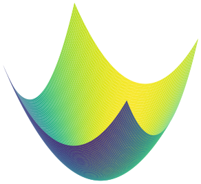

# Optimality conditions for unconstrained optimization

First, we consider the unconstrained optimization problem

```{math}
:label:optim-problem-unconstrained
\min_{x \in \mathbb{R}^n} f(x)
```

We assume that $f$ has "good" properties on $\mathbb{R}^n$, i.e., $f$ is twice continuously differentiable (or at least continuously differentiable).

Provided minimizers exist (not always guaranteed!), we will derive conditions on a point $x^*$ to be a minimizer of the problem.

:::{important}
Optimality conditions for the unconstrained optimization problem [](#optim-problem-unconstrained) can be of different types:

- **Necessary**, **sufficient** or **necessary and sufficient**
- **First-order** (i.e. involving $\nabla f$) or **second-order** (i.e. involving $\nabla^2 f$)
:::

Most of the results from this section are reproduced from @nocedal2006numerical [Chapter 2], where detailed proofs are available. 

### Necessary conditions (unconstrained case)

:::{prf:theorem} First-order necessary conditions [@nocedal2006numerical, Theorem 2.2]
:label:thm:necessary-unconstrained-first
If $x^\star$ is a local minimizer and $f$ is continuously differentiable in an open neighborhood of $x^\star$, then $\nabla f (x^\star) = 0$.
:::

We call $x^\star$ a **stationary** or **critical** point of $f$ if $\nabla f(x^\star) = 0$.

Any local minimizer must be a stationary point.

:::{prf:theorem} Second-order necessary conditions [@nocedal2006numerical, Theorem 2.3]
:label:thm:necessary-unconstrained-second
If $x^\star$ is a local minimizer and $f$ is twice continuously differentiable in an open neighborhood of $x^\star$, then $\nabla f(x^\star) = 0$ and $\nabla^2 f(x^\star) \succeq 0$ (is positive semidefinite).
:::

:::{exercise}
:class:dropdown
Prove [](#thm:necessary-unconstrained-first) and [](#thm:necessary-unconstrained-second) by contradiction using Taylor's theorem.
:::

:::::{warning} Having $\nabla f(x^\star) = 0$ is not (always) enough ...
[](#thm:necessary-unconstrained-first) and [](#thm:necessary-unconstrained-second) only give **necessary** conditions for a point $x^\star$ to be optimal. 
Some possible situations in 1D.
::::{grid}

:::{card}
:header: $f''(x^\star) = 0$ (maximum)


:::

:::{card}
:header: $f''(x^\star) = 0$ (saddle point)

:::

:::{card}
:header: $f''(x^\star) > 0$ (strict minimum)


:::
::::
For higher dimensions (here 2D), the situation is even more subtle.
::::{grid} 

:::{card}
:header: $\nabla^2 f (x^\star) \succ 0$ (strict minimum)


:::

:::{card}
:header: $\nabla^2 f (x^\star) \succeq 0$ (saddle point)

:::

:::{card}
:header: $\nabla^2 f(x^\star) \succeq 0$ (many local minima)


:::
::::
:::::

### Sufficient conditions (unconstrained case)

:::{prf:theorem} Second-order sufficient conditions [@nocedal2006numerical, Theorem 2.3]
Suppose that $\nabla^2 f$ is continuous in an open neighborhood of $x^\star$ and that $\nabla f(x^\star) = 0$ and $\nabla^2 f(x^\star) \succ 0$ (is positive definite). Then $x^\star$ is a strict local minimizer of $f$.
:::

:::{prf:remark}
- Sufficient conditions guarantee that the minimizer is a *strict* local minimizer. (Compare with the necessary conditions of [](#thm:necessary-unconstrained-first) and [](#thm:necessary-unconstrained-second))
- These sufficient conditions are not necessary: a point $x^\star$ can fail to satisfy the conditions and yet be a strict minimizer.

    Example: $f(x) = x^4$; the point $x^\star = 0$ is a strict local minimizer (and global as well) but $f''(0) = 0$ shows that the Hessian is not positive definite at this point.
:::

:::{exercise} Quadratic function  
:class:dropdown
Let $f:\mathbb{R}^2 \rightarrow \mathbb{R}$ such that $f(x) = x_1^2 - x_2^2$. Compute its gradient and Hessian. List critical points and their properties.
:::
:::{exercise} Rosenbrock function
:class:dropdown
Let $f:\mathbb{R}^2 \rightarrow \mathbb{R}$ such that $f(x) = (1-x_1)^2 + 5(x_2-x_1^2)^2$.

Does the point $[1, 1]^\top$ satisfy the necessary conditions? the sufficient conditions?
:::

### Necessary and sufficient conditions (unconstrained case)

When $f$ is convex there is a simple characterization of optimal points.

:::{prf:theorem} Unconstrained convex problems
Suppose that $f:\mathbb{R}^n\rightarrow \mathbb{R}$ is convex.  
A point $x^\star$ is a local minimizer (hence global) of $f$ if and only if $x^\star$ is a stationary point of $f$, i.e., such that $\nabla f(x^\star) = 0$.
:::

:::{prf:remark}
- If $f$ is strictly convex, then the theorem gives a characterization of the unique global minimizer of the problem (when it exists).
- Finding points such that $\nabla f (x^\star) = 0$ (stationary points) is the foundation for many unconstrained optimization algorithms, even in the non-convex case.
- In chapter 3, we'll see a very important application of this result to solve a very important category of optimization problems, called **least-squares** problems.
:::